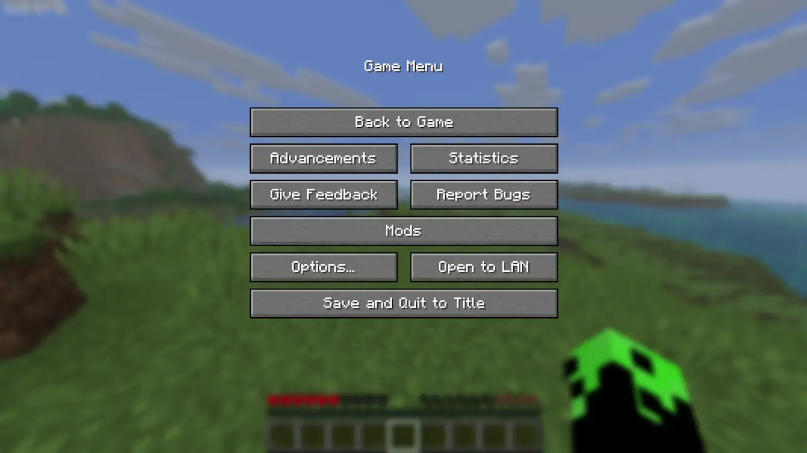
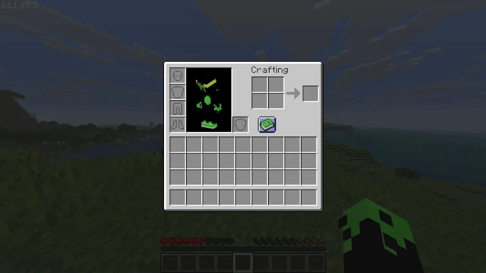
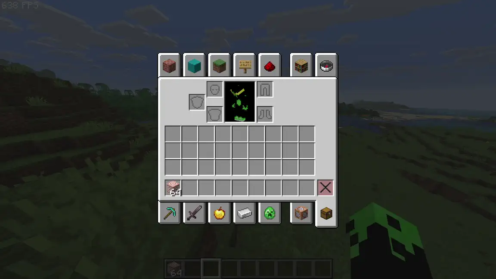

# Animated GUI

Minecraft's menus are *instant*. Items teleport between slots, the hotbar selector snaps from one slot to the
next, chat messages pop in, the creative inventory scrolls a whole page at a time, and screens blink open and
shut. **Animated GUI** replaces all of that with smooth, framerate-independent motion — and lets you tune the
style, speed and easing curve of every single one from a flat, Sodium-inspired settings screen.

> Fabric · Minecraft **26.1.2** · client-side only · by **dev-limucc**

<p align="center">
  
  
  
</p>

---

## Features

| Animation | What it does |
| --- | --- |
| **Chat** | New messages slide up from below and the older lines glide up with them, instead of hard-popping. |
| **Item move** | When a stack moves between slots (shift-click / quick-move, sorting, transfers), the icon glides from its old slot to the new one instead of teleporting. Stack-merges fly a ghost in and leave the existing stack put. |
| **Creative scroll** | The creative inventory's row-at-a-time "paging" is replaced with a true pixel-smooth slide — the slot grid *and* the items scroll together, by wheel or by dragging the scrollbar. |
| **Hotbar** | The selection box slides between hotbar slots instead of snapping (and snaps cleanly on the 8↔0 wrap). Optional motion-blur **trail**. |
| **Menu open / close** | Inventories, the pause menu and other screens scale or slide in when opened — and, thanks to a deferred close, animate *out* when closed too. The 3D inventory player model animates along with the panel. |
| **Menu navigation** | "Back"/"Done" between menus animates the old screen out before the new one animates in. |
| **Recipe book** | The recipe-book side panel slides in/out and the inventory glides aside to make room (instead of teleporting); paging recipes slides the grid. |

Every feature has its **own** enable toggle, **duration** (ms) and **easing curve**; screens additionally pick a
**movement style**. There's a master switch to freeze everything back to vanilla in one click.

### Easing curves
`Linear` · `Smooth` (sine) · `Ease-out` · `Ease-in` · `Ease-in-out` · `Overshoot` (back) · `Elastic` · `Bounce`

Pick `Overshoot` or `Elastic` on **Menu open** with the `Scale` style for a satisfying pop.

### Screen styles
`Scale` · `Slide up` · `Slide down` · `Slide left` · `Slide right`

---

## Settings

Open the **ModMenu** mod list → **Animated GUI** → cog. Everything is hit-tested and drawn by hand in the Limucc
flat UI style (dark translucent panel, accent-blue hover). Settings are saved to `config/animatedgui.json`.

```jsonc
{
  "masterEnabled": true,
  "chat":          { "enabled": true, "durationMs": 220, "easing": "EASE_OUT" },
  "items":         { "enabled": true, "durationMs": 200, "easing": "EASE_OUT" },
  "creativeScroll":{ "enabled": true, "durationMs": 220, "easing": "EASE_OUT" },
  "hotbar":        { "enabled": true, "durationMs": 150, "easing": "EASE_OUT" },
  "screenOpen":    { "enabled": true, "durationMs": 220, "easing": "EASE_OUT", "style": "SCALE" },
  "screenClose":   { "enabled": true, "durationMs": 180, "easing": "EASE_IN",  "style": "SCALE" },
  "hotbarTrail":   false
}
```

Recipe-book panel / inventory-shift / page-turn animations follow the **Menu open** setting.

---

## How it works

All motion is driven by wall-clock time (so it's smooth at any framerate) and routed through a single
retargetable [`Tween`](src/client/java/dev/limucc/animatedgui/client/anim/Tween.java): when a target changes
mid-animation the curve re-anchors at the current value, so nothing ever jumps.

The animations hook MC 26.1.2's deferred `GuiGraphicsExtractor` / `extractRenderState` render pipeline via Mixin:

- **Chat** — translate the chat pose down by the just-added line(s) and ease back to 0.
- **Hotbar** — recover the per-slot base from the selection sprite's x and re-place it with an eased "animated slot".
- **Creative** — keep a display scroll value that eases toward `scrollOffs` and re-issue `scrollTo` each frame.
- **Items** — diff the container's slots each frame, pair an emptied "source" with a filled "destination" of the same item, and offset the destination icon back toward the source.
- **Screens** — start an open timer on `Screen.added()`, wrap the content render with a scale/slide pose transform, and **defer** `setScreen(null)` so the outgoing screen survives long enough to animate out.

> **Note:** *Item move* and *Menu close* are best-effort by nature (stacking/crafting read as moves, which looks
> natural; close is deferred by a few frames). All animations degrade gracefully to vanilla if disabled.

---

## Building

Requires JDK 25.

```bash
./gradlew build
# -> build/libs/animated-gui-1.0.0.jar
```

Drop the jar (plus [Fabric API](https://modrinth.com/mod/fabric-api) and, for the settings screen,
[ModMenu](https://modrinth.com/mod/modmenu)) into your `mods/` folder.

---

## Reusable UI style library

The flat, animated look this mod uses is documented as a standalone, copy-paste-ready style library in
**[`STYLE.md`](STYLE.md)** — palette, the `Easing`/`Tween` motion engine, the `FlatButton` / `ToggleSwitch`
widget kit, the screen skeleton, and the screen-transition system. Lift any of it into another Fabric mod; the
core pieces are self-contained. (`AGENTS.md` is the short entry pointer for AI coding assistants.)

---

## License

MIT © dev-limucc — reuse freely.
